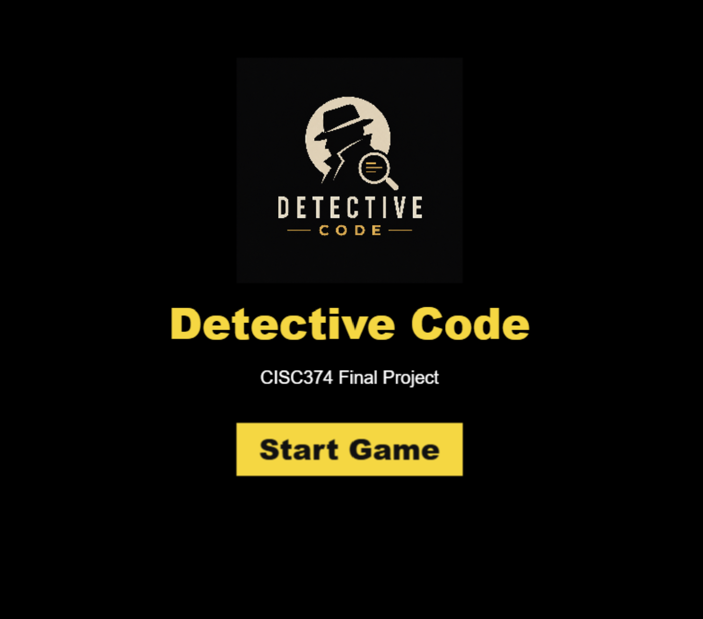
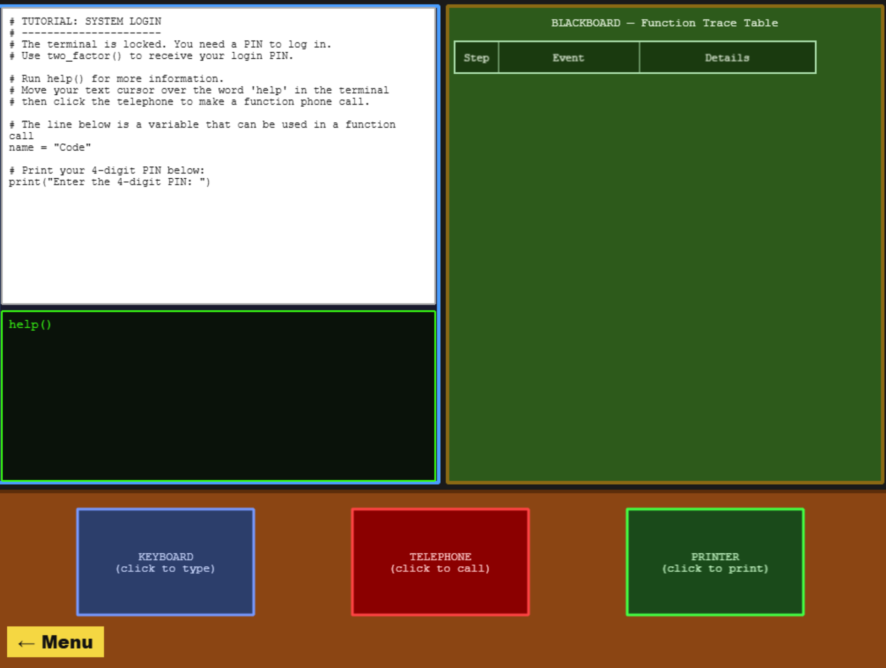

# Game Name

Detective Code

# Team Color

Cyan

# Developers

- Zhenyuan Wang (zywang@udel.edu)
- Connor (ccchip@udel.edu)

# Blurb

Detective Code is a single-player educational puzzle game that teaches players how function calls work in Python. Players take on the role of a beginner detective solving mysteries where clues are hidden inside code. To move forward, players read short programs, call functions, track returned values, and build a trace of what happens step by step. The game focuses on concepts like parameters, return values, nested function calls, and the call stack. Instead of just reading about debugging, players practice thinking like a program while using detective-themed tools such as a phone, blackboard, terminal, and printer.

# Basic Instructions

Read the puzzle description and inspect the Python code shown in the workspace. Use the terminal to call functions, test print statements, and gather information. Click the phone to view dialogue or help connected to a selected function. Use the blackboard to keep track of function calls, arguments, return values, and call stack order. When you think your program produces the correct report, click the printer to run your solution. If the report is correct, continue to the next level. If not, use the hint and revise your code.

# Screenshot

# Gameplay Video

[Watch the gameplay video](https://drive.google.com/file/d/1B_LHi6ybrunRxGUeLxA8mPGQFXAfwgoW/view)

# Educational Game Design Document

Link to our [egdd](./docs/egdd.md)

# Credits

Chatgpt image2
